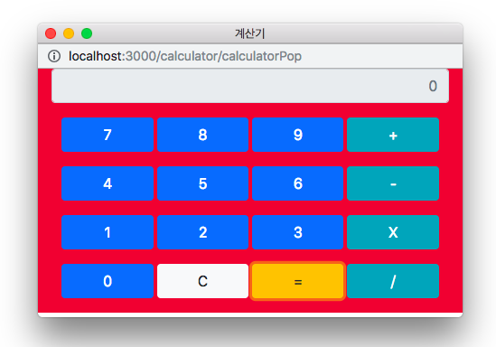

# NodeCalculator(Node.js로 만든 계산기)
 <br>
개발 환경:<br>
Server: Node.js<br>
Client: JavaScript, Html5/css, bootstrap4<br><br>
사칙연산이 가능한 계산기입니다.<br>
'='을 클릭할 경우, <u>서버에서 계산한 결과 값을 비동기로 화면에 표시해줍니다.</u>
<br>
백스페이스를 눌릴 경우 입력한 값을 수정할 수 있습니다.
Node.js를 공부하는 중인데 간단하게 계산기를 만들어봤습니다.

사용방법<br>
1. 의존성 관리
```bash
$ npm install
```
<br>
2. nodemon으로 서버 실행

```bash
$ nodemon app
```

<br>
3. 계산기 실행해보기

`
localhost:3000/main
`
